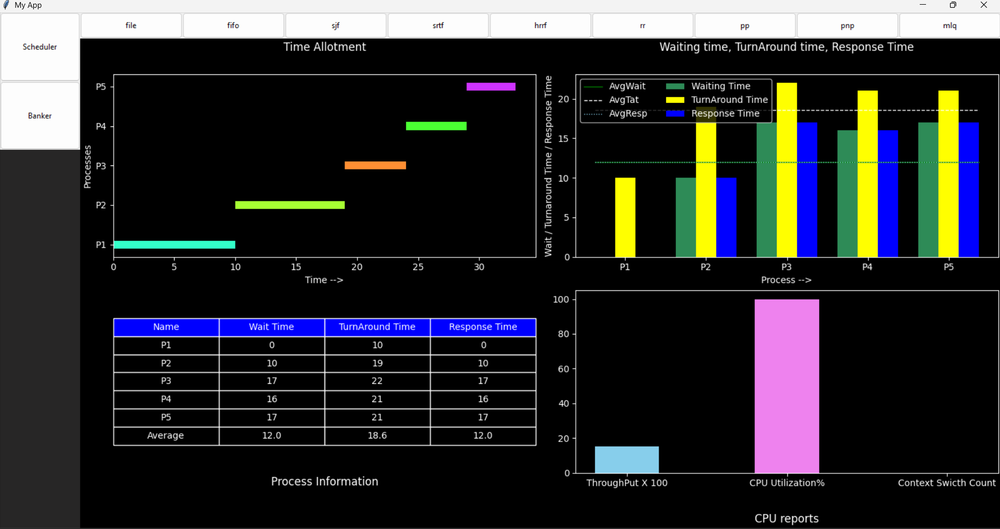

# Welcome to DashProc process scheduling analyzer
**DESCRIPTION** - This is a minimal python desktop app 
- To visualize, how processes in a computer are scheduled
based on different native yet powerfull scheduling algorithms.
- To compute, different CPU and process parameters important for analyzing efficiency of a chosen algorithm.
    - It can compute gantt chart of a given algorithm for a given input.
    - It can compute waiting time, turnaround time and response time of each process and their averages, visualizing them in a barchart.
    - It can compute CPU utilization, throughput and context switch count.
    - Most importantly, it can visualize **R**esource **A**llocation **G**raph (RAG) and can check safety conditions and generate safety sequence, for a given input.
- To help OS designers simulate simple scheduling algorithms for automating their analyzing and scheduler designing tasks.
- And lastly, to help students, learn how scheduling algorithms schedule processes.
***
### Steps to use this app :

- Clone this repo inside your virtual environment using
    ```sh
    git clone https://github.com/roysparsha8/DashProc.git project
    cd project/
    ```
- Install dependencies
    ```sh
    pip install -r requirements.txt
    ```
- Note that ```ui.py``` is the main start point of app. Run
    ```powershell
    python ui.py # In powershell
    ```
    OR
    ```sh
    python3 ui.py # In bash
    ```
- The app uses inputs from files. Take help for format of input from the added example files - ```Book1.csv```(For Schedulers) and ```sample_data.json``` (For Bankers).
- Watch the video for rest of explanation 
    [](./assets/video1.mp4)
- Note that, here ```ts``` stands for **Time Slice** which is required for Round Robin algorithm and ```qts``` stands for **Queue Time Slice** and it is required for applying Round Robin on queues in case of *Multilevel Feedback Queue*.
- Other abbreviations - 
    - ```fifo``` - First Inn First Out.
    - ```sjf``` - Shortest Job First.
    - ```srtf``` - Shortest Remaining Time First.
    - ```hrrf``` - Highest Response Ratio First.
    - ```rr``` - Round Robin.
    - ```pp``` - Preemptive Priority Scheduling.
    - ```pnp``` - Non Preemptive Priority Scheduling.
    - ```mlq``` - Multilevel Queue. (Uses upto two queue - System and User queue).
***
### Finally
- The project is inspired from my regular Operating System Laboratory tasks. Any bugfix will surely gonna help me in my labs. 
- I'll request everyone to please review by project and feel free to reach out for any kind of ui modifications, design updations or bug fixes.

Thank you for your patience.


[def]: ./assets/video1.mp4